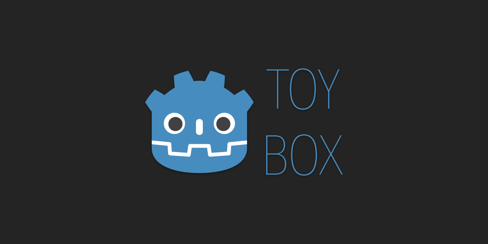

<p align="center">
  
</p>

<h1 align="center">Godot Toybox</h1>

<p align="center">
  <i>An open box of reusable creative-dev toys for Godot: shaders, VFX, rendering experiments, and whatever else I felt like building.</i>
</p>

<p align="center">
  
  
  
  
</p>

---

## Hey! What is this?

I'm a **game programmer**, and sometimes I build things in Godot just because they're fun to make. Shaders, visual effects, weird little rendering experiments, animated boot splashes... that kind of stuff.

Instead of letting them rot on my hard drive, I'm tossing them all into one box: **Godot Toybox**.

Everything here is **free to take, learn from, remix, and ship**. No paywall, no catch. If something's useful to you, it's yours.

---

## What's in the box?

> The toybox is just getting started, so it'll keep growing as I keep experimenting. Here's what's inside right now:

### Shaders & Effects

The `GodotToybox/` folder is a full Godot project containing everything I'm putting together. Drop it open in the editor and poke around.

<!-- TODO: add shader gifs -->
<p align="center">
  
  
  
</p>

| Toy | What it does |
| --- | --- |
| `shader_name_01` | _One-line description of what it does._ |
| `shader_name_02` | _One-line description of what it does._ |
| `shader_name_03` | _One-line description of what it does._ |

> 🛠️ Swap the table rows above with your actual shader names + descriptions.

---

### 🎬 Animated Boot Splashes

Two takes on the Godot logo boot splash, built entirely for the joy of it. Same source art, wildly different moods. Files live in `splashscreens/`.

#### 🩸 Halloween Edition (2025)

Bloody, gory, and a little unhinged. The Godot logo, but make it a crime scene.

<!-- TODO: add bootsplash gifs -->
<p align="center">
  
</p>

#### ✨ Fancy Edition (2026)

Fancy, elegant, and a little bit show-off-y. Same logo, all sparkle.

<p align="center">
  
</p>

**Built with:** Photoshop (layer separation) → After Effects (animation, VFX, color, particles) → Audacity (SFX editing) → DaVinci Resolve (sound mix).

---

## 🚀 How to use it

1. **Clone or download** the repo:
   ```bash
   git clone https://github.com/PedroVillasBoas/Godot-Toybox.git
   ```
2. **Open** `GodotToybox/` in Godot 4.x to explore the shaders and effects.
3. **Grab** whatever you need. Copy a shader, lift an effect, use a boot splash as-is.
4. **Ship it.** That's literally the whole point. 🛠️

> The boot splash videos in `splashscreens/` are ready to use directly, no Godot project needed.

---

## 🧪 Roadmap-ish

This isn't a roadmap so much as a vibe. Stuff I might add as I build it:

- [ ] More shaders (the box always has room)
- [ ] Utility scripts & helpers
- [ ] Rendering experiments
- [ ] Prototype systems & reusable components
- [ ] More boot splashes (because why not)

Got an idea for a toy you'd love to see? **Open an issue or drop it in the discussions**. I'm always hunting for the next thing to build. 👀

---

## 🤝 Contributing

This is mostly a personal sandbox, but if you want to fix something, suggest a toy, or share an improvement, pull requests and issues are very welcome. Keep it friendly, keep it fun.

---

## 🙏 Credits

- **Engine:** [Godot](https://godotengine.org/) - the wonderful little engine that could 💙
- **Boot splash art:** by [Kenney](https://github.com/KenneyNL/Godot-SplashScreens) - absolute legend of free game assets
- **SFX:** edited in Audacity from a sound bundle I've had for a while

---

## 📜 License

Released under the **[MIT License](LICENSE)** - use it for personal or commercial projects, no strings attached. A credit/star is never required but always appreciated. ⭐

---

<p align="center">
  Made with too much coffee + energy drinks and not enough sleep by <a href="https://github.com/PedroVillasBoas">Pedro Vilas Bôas</a>!
</p>